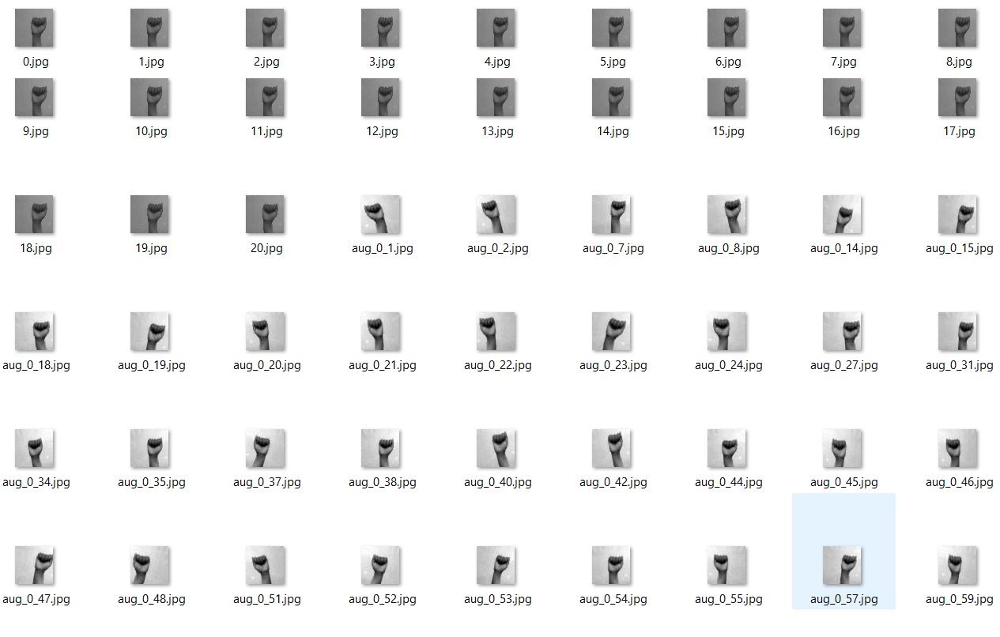
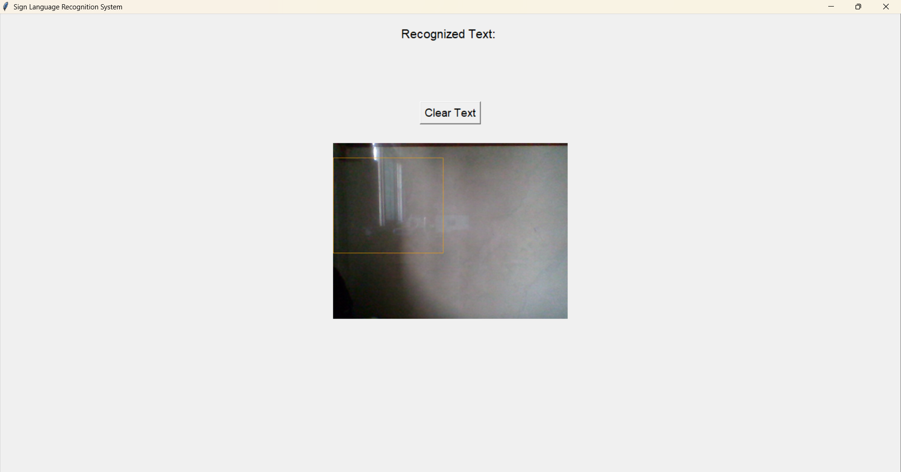

# Sign Language Interpretation System

A Deep Learning–based real-time Sign Language Interpretation System designed to bridge the communication gap between deaf or mute individuals and hearing speakers by converting hand gestures into readable text and synthesized speech.

---

## Overview

This project implements a complete end-to-end pipeline including:

- Custom dataset collection
- Data preprocessing and augmentation
- Convolutional Neural Network (CNN) model design
- Real-time gesture recognition
- Desktop application with visual and audio feedback

The system performs low-latency real-time inference using a trained deep learning model integrated with OpenCV.

---

## Sample Dataset

Below is a sample image from the custom 48x48 grayscale dataset used for training:

---

## Desktop Application Interface

A Tkinter-based GUI provides live camera feed, prediction display, and text-to-speech output for recognized gestures.

---

## System Architecture

### 1. Data Collection

A custom dataset was captured using OpenCV with:

- Controlled lighting conditions
- Uniform background
- 48×48 grayscale preprocessing
- Standardized region of interest extraction

The dataset includes A–Z alphabets and a blank class.

Due to large size, the dataset is not included in this repository.

---

### 2. Model Development

A custom Convolutional Neural Network (CNN) was built using TensorFlow/Keras.

Model characteristics:

- 48×48 grayscale input
- Convolution and pooling layers for spatial feature extraction
- Fully connected layers for classification
- Softmax activation for multi-class output

The network automatically learns features directly from image data.

---

### 3. Real-Time Inference Pipeline

The real-time detection system integrates:

- OpenCV for frame capture
- Image preprocessing for consistency
- TensorFlow/Keras for prediction
- Immediate classification output

This enables smooth, low-latency sign recognition.

---

## Technologies Used

Python  
TensorFlow  
Keras  
OpenCV  
NumPy  
Tkinter  
Jupyter Notebook / Google Colab  

---

## Project Structure
Sign-Language-Interpretation-System/
│
├── images/
│   ├── sample_dataset.png
│   ├── realtime_output.png
│   └── gui_interface.png
│
├── augment_image.py
├── data_Collection.py
├── gui_interface.py
├── model_train_colab.ipynb
├── realtime_signdetection.py
├── signlanguagemodel48x48.json
├── signlanguagemodel48x48.h5
├── split_data.py
├── requirements.txt
└── README.md

---

## How to Run

### Install Dependencies

pip install -r requirements.txt

### Collect Dataset

python data_Collection.py

### Train Model

Open and run model_train_colab.ipynb

### Run Real-Time Detection

python realtime_signdetection.py

### Launch Desktop Application

python gui_interface.py

---

## Key Highlights

- Custom dataset created from scratch
- Deep Learning–based Computer Vision system
- Real-time webcam gesture recognition
- Integrated GUI with speech output
- End-to-end pipeline from data collection to deployment

---

## Future Improvements

- Sentence-level gesture recognition
- Transfer learning with advanced architectures
- Web or mobile deployment
- Expanded vocabulary support

---

## Author

Pralipta Rout  
Deep Learning and Computer Vision Enthusiast